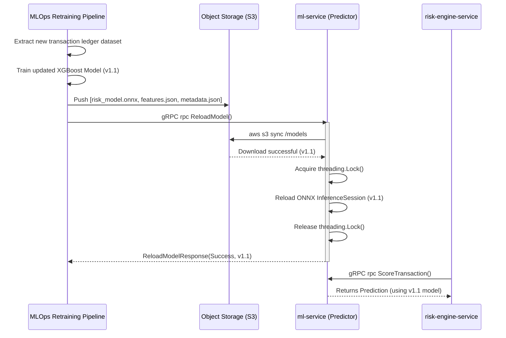

# Aegis Risk Engine

Aegis Risk is an advanced, microsecond-latency ML-driven microservice orchestration designed to intercept and evaluate financial transactions for fraud asynchronously. It seamlessly blends hard business rules with predictive intelligence across a containerized, decoupled architecture.

---

## Service Architecture

The system is split into four highly specialized microservices, communicating synchronously via **gRPC** and asynchronously via **AWS SQS** streams.

### 1. API Gateway (`api-gateway`)
The edge of the network. It handles all Internet-facing interactions over REST HTTP.
- **Edge Security**: Exposes public REST API endpoints (`/transactions`, `/auth`) built entirely in `FastAPI`.
- **JWT & Rate Limiting**: Intercepts packets to validate asymmetric JWT access tokens and enforces strict rate limiting decoupled via `Redis`.
- **gRPC Translation**: Validates massive incoming JSON structures using Pydantic, instantly translating them into strictly typed Protobuf messages and dispatching them down to the internal subnet via high-speed gRPC Channels.

### 2. Transaction Service (`transaction-service`)
The system's mission-critical ledger ingress and data harmonization layer.
- **State Persistence**: Handles raw transaction lifecycle management through `PostgreSQL` using `SQLAlchemy` ORM native async drivers.
- **Strict Two-Way Idempotency**:
  - **Ingress Safety (DB Level)**: Transactions submitted with identical `idempotency_key` arguments are evaluated mathematically. If standard inputs strictly match an existing identical record, it catches the request and safely surfaces the historical response. If they conflict, it surfaces a lethal `DuplicateTransactionError` to prevent replay collisions.
  - **Egress Safety (SQS)**: Operations execute asynchronously downstream via SQS queues containing rigid payload correlation IDs. Downstream workers can infinitely replay dropped SQS events without mutating side-effects.

### 3. Risk Engine Service (`risk-engine-service`)
The operational orchestrator of business intelligence. It does not blindly trust AI; it operates as an intelligent governor.
- **Rules-First Heuristic Engine**: Checks incoming transactions against a modular pipeline of Python-based hard heuristics (E.g. `AccountAgeRule`, `VelocityRule`). It guarantees absolute, deterministic compliance limits are honored natively (like offering $50.00 grace periods for onboarding accounts).
- **ML Aggregation (The Scorer)**: Dynamically weights Rule-based intelligence against purely statistical ML Intelligence in a default `70% / 30%` mix. It algorithmically suppresses and penalizes false positive probability noise dynamically generated by the ML model.
- **Decision Engine**: Calculates floating thresholds to surface terminal mapping choices (`APPROVE / REVIEW / BLOCK`) which lock the pipeline.

### 4. ML Service (`ml-service`)
Sub-millisecond machine learning inference isolation module. Designed purely for statistical pattern recognition.
- **ONNX Predictor**: Wraps heavily imbalanced, high-depth XGBoost Fraud logic (trained on standard financial anomaly data like *PaySim*) natively into `ONNX runtime`.
- **Hot-Swapping (Zero Downtime)**: Features a Thread-Safe singleton lock pattern coupled natively to a `Boto3 S3Client`.
    - Integrates a `ReloadModel` gRPC RPC that securely pulls `risk_model.onnx` and its mapping schemas from AWS S3 natively into memory, hot-swapping the inference brain locally without dropping a single TCP connection.

---

## Future Scaling & MLOps

Because fraud methodologies shift universally due to Data Drift, Aegis Risk implements a **Thread-Safe Hot-Swapping Architecture** allowing Airflow pipelines to natively push parameter iterations in production continuously.

